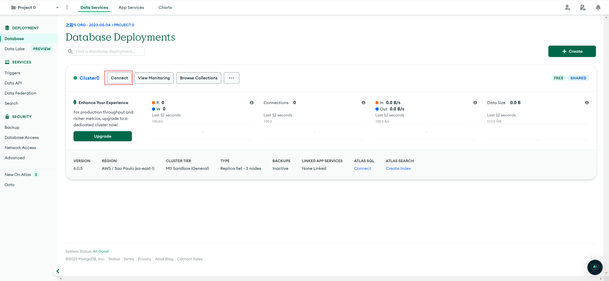
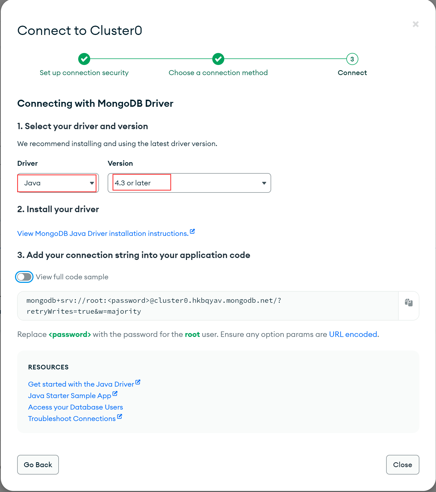

# MongoDB Java Driver 文档（V4.9.0）

## 各版本新特性

### 4.9

- 添加了一个新的异常，用于标识由 `BsonCreator` 注释的构造函数除了包含具有 `BsonProperty` 或 `BsonId` 以外注释的参数。
- 修改了 `org.mongodb.driver.protocol.command` 包上报的命令监控消息的日志格式。
- 向 `Aggregate` 帮助类添加了对 `$documents` 聚合管道阶段的支持。
- 添加了 `MongoClientSettings.Builder.applyToLoggerSettings()` 和 `LoggerSettings.Builder.maxDocumentLength()` 方法，用于在日志消息中为 `BSON` 文档的扩展 `JSON` 表示指定最大长度

其他特性参考链接：[whats-new](https://mongodb.github.io/mongo-java-driver/4.9/whats-new/)

## Java 驱动

### 简介

欢迎访问 Java 驱动程序的文档网站，Java 驱动程序是用于同步 Java 应用程序的官方 MongoDB 驱动程序。使用 Maven 或 Gradle 下载，或者按照我们的快速入门指南设置一个可运行的项目。

如果 Java 应用程序需要异步流处理，请使用 Reactive Streams Driver，该驱动程序使用 ReactiveStreams 对 MongoDB 进行非阻塞调用。

### 快速开始

#### 介绍

本指南展示了如何创建一个使用 Java 驱动程序连接到 MongoDB Atlas 集群的应用程序。

Java 驱动程序允许从 Java 应用程序连接到 MongoDB 集群并与之通信。

MongoDB Atlas 是一个完全托管的云数据库服务，在 MongoDB 集群上托管你的数据。在本指南中，我们将向你展示如何开始使用你自己的免费（无需支付）集群。

请参阅以下步骤，将 Java 应用程序与 MongoDB Atlas 集群连接起来。

#### 设置项目

##### 安装 Java 开发工具（JDK）

请确保你的系统安装了 JDK 8 或更高版本。有关如何检查 Java 版本并安装 JDK 的更多信息，请参阅 [Oracle JDK 安装文档概述](https://www.oracle.com/java/technologies/javase-downloads.html)。

##### 创建项目

本指南向你展示如何使用 Maven 或 Gradle 添加 MongoDB Java 驱动程序依赖项。我们建议你使用集成开发环境（IDE），如 Intellij IDEA 或 Eclipse IDE，这样可以更方便地配置 Maven 或 Gradle 来构建和运行你的项目。

如果你没有使用 IDE，请参阅 [Building Maven](https://maven.apache.org/guides/development/guide-building-maven.html) 或 [Creating New Gradle Builds](https://guides.gradle.org/creating-new-gradle-builds/)，了解有关如何设置项目的更多信息。

##### 将 MongoDB 添加为依赖项

如果你正在使用 Maven，请将以下内容添加到 `pom.xml` 依赖项列表中：

```xml
<dependencies>
    <dependency>
        <groupId>org.mongodb</groupId>
        <artifactId>mongodb-driver-sync</artifactId>
        <version>4.9.1</version>
    </dependency>
</dependencies>
```

如果你正在使用 Gradle，请将以下内容添加到你的 `build.gradle` 依赖项列表中：

```text
dependencies {
  implementation 'org.mongodb:mongodb-driver-sync:4.9.1'
}
```

一旦配置了依赖项，请确保它们可用于你的项目，这可能需要运行依赖项管理器并在 IDE 中刷新项目。

#### 创建 MongoDB 集群

##### 在 Atlas 中建立一个免费分层集群

在设置 Java 项目依赖项之后，创建一个 MongoDB 集群，你可以在其中存储和管理数据。完成 [Atlas 入门](https://www.mongodb.com/docs/atlas/getting-started/?jmp=docs_driver_java)指南，设置一个新的 [Atlas 帐户](https://account.mongodb.com/account/register?tck=docs_atlas&_ga=2.85896410.238876901.1683168999-176447065.1683168999)，创建并启动一个免费层 MongoDB 集群，加载数据集，并与数据交互。

完成 Atlas 指南中的步骤后，你应该在 Atlas 中部署了一个新的 MongoDB 集群、一个新的数据库用户以及将示例数据集加载到集群中。

##### 连接到集群

在这一步中，我们创建并运行一个应用程序，该应用程序使用 MongoDB Java 驱动程序连接到 MongoDB 集群，并对样本数据运行查询。

我们在一个名为连接字符串的字符串中向驱动程序传递如何连接到 MongoDB 集群的说明。此字符串包括有关群集的主机名或 IP 地址和端口、身份验证机制、用户凭据（如果适用）以及其他连接选项的信息。

如果你正在连接到非 Atlas 托管的实例或集群，请参阅[连接到 MongoDB 的其他方法](https://www.mongodb.com/docs/drivers/java/sync/current/fundamentals/connection/connect/#std-label-java-other-ways-to-connect)，以获取有关如何格式化连接字符串的说明。

要检索你在上一步中创建的集群和用户的连接字符串，请登录你的 Atlas 帐户并导航到**数据库**部分，然后单击要连接到的集群的**连接**，如下所示：



继续 “Connect to your application” 步骤，然后选择 Java 驱动程序。选择 “4.3 or later” 作为版本。单击 “复制” 图标将连接字符串复制到剪贴板，如下所示：



将 Atlas 连接字符串保存在一个安全的位置，以便你可以访问该位置以进行下一步操作。

##### 从应用程序查询 MongoDB 集群

接下来，在项目的基本包目录中创建一个名为 `QuickStart.java` 的文件来包含你的应用程序。使用以下示例代码在 MongoDB Atlas 中对你的示例数据集运行查询，将 `uri` 变量的值替换为 MongoDB Atlas 连接字符串。

```java
import static com.mongodb.client.model.Filters.eq;

import org.bson.Document;

import com.mongodb.client.MongoClient;
import com.mongodb.client.MongoClients;
import com.mongodb.client.MongoCollection;
import com.mongodb.client.MongoDatabase;

public class QuickStart {
    public static void main( String[] args ) {

        // Replace the placeholder with your MongoDB deployment's connection string
        String uri = "<connection string uri>";

        try (MongoClient mongoClient = MongoClients.create(uri)) {
            MongoDatabase database = mongoClient.getDatabase("sample_mflix");
            MongoCollection<Document> collection = database.getCollection("movies");

            Document doc = collection.find(eq("title", "Back to the Future")).first();
            if (doc != null) {
                System.out.println(doc.toJson());
            } else {
                System.out.println("No matching documents found.");
            }
        }
    }
}
```

当你运行 `QuickStart` 类时，它应该从示例数据集中输出电影的详细信息，该数据集看起来如下：

```text
{
  _id: ...,
  plot: 'A young man is accidentally sent 30 years into the past...',
  genres: [ 'Adventure', 'Comedy', 'Sci-Fi' ],
  ...
  title: 'Back to the Future',
  ...
}
```

如果没有收到输出或错误，请检查 Java 类中是否包含了正确的连接字符串，以及是否将示例数据集加载到 MongoDB Atlas 集群中。

> **重要**
> 
> **使用 TLS v1.3 时的已知连接问题**
> 
> 如果在运行应用程序时，连接到 MongoDB 实例或集群时遇到类似以下情况的错误，你可能需要将 JDK 更新到最新的补丁版本：
> 
> `javax.net.ssl.SSLHandshakeException: extension (5) should not be presented in certificate_request`
> 
> 当将 TLS 1.3 协议与特定版本的 JDK 一起使用时，此异常是一个已知问题，但在以下版本中已修复：
> 
> - JDK 11.0.7 
> - JDK 13.0.3 
> - JDK 14.0.2
> 
> 要解决此错误，请将 JDK 更新到以前的修补程序版本或更新的版本。

完成这一步后，你应该有一个使用 Java 驱动程序连接到 MongoDB 集群的工作应用程序，对样本数据运行查询，并打印出结果。

##### 使用 POJO（可选）

在上一节中，你对示例集合运行了一个查询，以检索类似映射的类 `Document` 中的数据。在本节中，你可以学习使用自己的 Plain Old Java Object（POJO）来存储和检索 MongoDB 中的数据。

在项目的基本包目录中创建一个名为 `Movie.java` 的文件，并为包含以下字段、setter 和 getter 的类添加以下代码：

```java
public class Movie {
    String plot;
    List<String> genres;
    String title;

    public String getPlot() {
        return plot;
    }
    public void setPlot(String plot) {
        this.plot = plot;
    }
    public List<String> getGenres() {
        return genres;
    }
    public void setGenres(List<String> genres) {
        this.genres = genres;
    }
    public String getTitle() {
        return title;
    }
    public void setTitle(String title) {
        this.title = title;
    }
    @Override
    public String toString() {
        return "Movie [\n  plot=" + plot + ",\n  genres=" + genres + ",\n  title=" + title + "\n]";
    }
}
```

在与项目中的 `Movie` 文件相同的包目录中创建一个新文件 `QuickStartPojoExample.java` 。使用以下示例代码在 MongoDB Atlas 中对你的示例数据集运行查询，将 `uri` 变量的值替换为 MongoDB Atlas 连接字符串。请确保将连接字符串的 “<password>” 部分替换为你为具有 **atlasAdmin** 权限的用户创建的密码：

```java
import static com.mongodb.MongoClientSettings.getDefaultCodecRegistry;
import static com.mongodb.client.model.Filters.eq;
import static org.bson.codecs.configuration.CodecRegistries.fromProviders;
import static org.bson.codecs.configuration.CodecRegistries.fromRegistries;

import org.bson.codecs.configuration.CodecProvider;
import org.bson.codecs.configuration.CodecRegistry;
import org.bson.codecs.pojo.PojoCodecProvider;

import com.mongodb.client.MongoClient;
import com.mongodb.client.MongoClients;
import com.mongodb.client.MongoCollection;
import com.mongodb.client.MongoDatabase;

public class QuickStartPojoExample {

    public static void main(String[] args) {
        CodecProvider pojoCodecProvider = PojoCodecProvider.builder().automatic(true).build();
        CodecRegistry pojoCodecRegistry = fromRegistries(getDefaultCodecRegistry(), fromProviders(pojoCodecProvider));

        // Replace the uri string with your MongoDB deployment's connection string
        String uri = "<connection string uri>";

        try (MongoClient mongoClient = MongoClients.create(uri)) {
            MongoDatabase database = mongoClient.getDatabase("sample_mflix").withCodecRegistry(pojoCodecRegistry);
            MongoCollection<Movie> collection = database.getCollection("movies", Movie.class);

            Movie movie = collection.find(eq("title", "Back to the Future")).first();
            System.out.println(movie);
        }
    }
}
```

当你运行 `QuickStartPojoExample` 类时，它应该从示例数据集中输出电影的详细信息，该数据集应该如下所示：

```text
Movie [
  plot=A young man is accidentally sent 30 years into the past...,
  genres=[Adventure, Comedy, Sci-Fi],
  title=Back to the Future
]
```

如果没有收到输出或错误，请检查 Java 类中是否包含了正确的连接字符串，以及是否将示例数据集加载到 MongoDB Atlas 集群中。

有关使用 POJO 存储和检索数据的更多信息，请参阅以下链接：

- [使用 POJO 存储和检索数据指南](https://www.mongodb.com/docs/drivers/java/sync/current/fundamentals/data-formats/document-data-format-pojo/)
- [POJO 自定义序列化指南](https://www.mongodb.com/docs/drivers/java/sync/current/fundamentals/data-formats/pojo-customization/)

#### 下一步

在基础 CRUD 指南中学习如何使用 Java 驱动程序读取和修改数据，或者在用法示例中学习如何执行常见操作。

### 快速参考

本页显示了几个 MongoDB 命令的驱动程序语法，并链接到相关的参考和 API 文档。

- 查询单个文档

`coll.find(Filters.eq("title", "Hamlet")).first();`

```text
{ title: 'Hamlet', type: 'movie', ... }
```

- 查询多个文档

`coll.find(Filters.eq("year", 2005))`

```text
[
  { title: 'Christmas in Boston', year: 2005, ... },
  { title: 'Chicken Little', year: 2005, ... },
  ...
]
```

- 插入单个文档

`coll.insertOne(new Document("title", "Jackie Robinson"));`

- 插入多个文档

```shell
coll.insertMany(
    Arrays.asList(
            new Document("title", "Dangal").append("rating", "Not Rated"),
            new Document("title", "The Boss Baby").append("rating", "PG")));
```

- 更新单个文档

```shell
coll.updateOne(
        Filters.eq("title", "Amadeus"),
        Updates.set("imdb.rating", 9.5));
```

```text
{ title: 'Amadeus', imdb: { rating: 9.5, ... } }
```

- 更新多个文档

```shell
coll.updateMany(
        Filters.eq("year", 2001),
        Updates.inc("imdb.votes", 100));
```

```text
[
  { title: 'A Beautiful Mind', year: 2001, imdb: { votes: 826257, ... },
  { title: 'Shaolin Soccer', year: 2001, imdb: { votes: 65442, ... },
  ...
]
```

- 在文档中更新数组

```shell
coll.updateOne(
        Filters.eq("title", "Cosmos"),
        Updates.push("genres", "Educational"));
```

```text
{ title: 'Cosmos', genres: [ 'Documentary', 'Educational' ], ...}
```

- 文档替换

```shell
coll.replaceOne(
        Filters.and(Filters.eq("name", "Deli Llama"), Filters.eq("address", "2 Nassau St")),
        new Document("name", "Lord of the Wings").append("zipcode", 10001));
```

```text
{ name: 'Lord of the Wings', zipcode: 10001 }
```

- 删除单个文档

```text
coll.deleteOne(Filters.eq("title", "Congo"));
```

- 删除多个文档

```shell
coll.deleteMany(Filters.regex("title", "^Shark.*"));
```

- 批量写入

```shell
coll.bulkWrite(
        Arrays.asList(
               new InsertOneModel<Document>(
                       new Document().append("title", "A New Movie").append("year", 2022)),
               new DeleteManyModel<Document>(
                       Filters.lt("year", 1970))));
```

- 查看变更

```shell
coll.watch(Arrays.asList(
        Aggregates.match(Filters.gte("year", 2022))));
```

- 通过游标迭代器访问数据

```shell
MongoCursor<Document> cursor = coll.find().cursor();
while (cursor.hasNext()) {
    System.out.println(cursor.next().toJson());
}
```

```text
[
  { title: '2001: A Space Odyssey', ... },
  { title: 'The Sound of Music', ... },
  ...
]
```

- 以数组形式访问查询的结果

```shell
List<Document> resultList = new ArrayList<Document>();
coll.find().into(resultList);
```

```text
[
  { title: '2001: A Space Odyssey', ... },
  { title: 'The Sound of Music', ... },
  ...
]
```

- 文档计数

```shell
coll.countDocuments(Filters.eq("year", 2000));
```

```text
618
```

- 列出不同的文档或字段值

```shell
coll.distinct("year", Integer.class);
```

```text
[ 1891, 1893, 1894, 1896, 1903, ... ]
```

- 限制检索文档的数量

```shell
coll.find().limit(2);
```

```text
[
  { title: 'My Neighbor Totoro', ... },
  { title: 'Amélie', ... }
]
```

- 跳过检索文档

```shell
coll.find(Filters.regex("title", "^Rocky")).skip(2);
```

```text
[
  { title: 'Rocky III', ... },
  { title: 'Rocky IV', ... },
  { title: 'Rocky V', ... }
]
```

- 检索文档时对文档进行排序

```shell
coll.find().sort(Sorts.ascending("year"));
```

```text
[
  { title: 'Newark Athlete', year: 1891, ... },
  { title: 'Blacksmith Scene', year: 1893, ...},
  { title: 'Dickson Experimental Sound Film', year: 1894},
  ...
]
```

- 检索项目文档字段

```shell
coll.find().projection(Projections.fields(
       Projections.excludeId(),
       Projections.include("year", "imdb")));
```

```text
[
  { year: 2012, imdb: { rating: 5.8, votes: 230, id: 8256 }},
  { year: 1985, imdb: { rating: 7.0, votes: 447, id: 1654 }},
  ...
]
```

- 创建索引

```shell
coll.createIndex(
        Indexes.compoundIndex(
                Indexes.ascending("title"),
                Indexes.descending("year")));
```

- 文本搜索

```shell
// only searches fields with text indexes
coll.find(Filters.text("zissou"));
```

```text
[
  { title: 'The Life Aquatic with Steve Zissou', ... }
]
```

- 用 Maven 安装驱动依赖

```xml
<dependencies>
  <dependency>
    <groupId>org.mongodb</groupId>
    <artifactId>mongodb-driver-sync</artifactId>
    <version>4.9.1</version>
  </dependency>
</dependencies>
```

- 用 Gradle 安装驱动依赖

```gradle
dependencies {
  implementation 'org.mongodb:mongodb-driver-sync:4.9.1'
}
```

### 使用案例

#### 概述

使用示例为流行的 MongoDB 操作提供了方便的起点。每个示例都提供了以下信息：

- 示例中的操作说明，显示了该方法的目的和示例用例
- 关于如何使用该操作的说明，包括参数、返回值和可能遇到的常见异常
- 一个完整的 Java 类，你可以复制并粘贴它，以便在自己的环境中运行示例

##### 如何使用用法示例

这些示例使用 Atlas 提供的样本数据集。你可以按照《Atlas 入门指南》将它们加载到 MongoDB Atlas 免费层的数据库中，也可以将示例数据集导入本地 MongoDB 实例中。

导入数据集后，可以将使用示例复制并粘贴到你选择的开发环境中。你可以按照快速入门指南了解有关 MongoDB Java 驱动程序入门的更多信息。一旦你复制了一个使用示例，你需要编辑连接 URI 以将该示例连接到你的 MongoDB 实例：

```java
// Replace the following with your MongoDB deployment's connection string.
String uri = "<connection string uri>";
```

你可以使用 [Atlas 连接指南](https://www.mongodb.com/docs/guides/cloud/connectionstring/)了解如何允许连接到你的 Atlas 实例，并找到在用法示例中用于替换 uri 变量的连接字符串。如果你的实例使用 [SCRAM 身份验证](https://www.mongodb.com/docs/manual/core/security-scram/)，则可以将 `<user>` 替换为用户名，将 `<password>` 替换为密码，将 `<cluster-url>` 替换为实例的 IP 地址或 url。

有关连接到 MongoDB 实例的更多信息，请参阅我们的[连接指南](https://www.mongodb.com/docs/drivers/java/sync/current/fundamentals/connection/)。

#### 查询操作

##### 查询单个文档

你可以通过将一个 `MongoCollection` 对象上的 `find()` 和 `first()` 方法链接在一起来检索集合中的单个文档。你可以将查询过滤器传递给 `find()` 方法，以查询并返回集合中与过滤器匹配的文档。如果不包含过滤器，MongoDB 将返回集合中的所有文档。`first()` 方法返回第一个匹配的文档。

有关使用 Java 驱动程序查询 MongoDB 的更多信息，请参阅我们的[文档查询指南](https://www.mongodb.com/docs/drivers/java/sync/current/fundamentals/crud/read-operations/retrieve/)。

你还可以将其他方法链接到 `find()` 方法，例如 `sort()` 按指定顺序组织匹配的文档和 `projection()` 配置返回文档中包含的字段。

有关 `sort()` 方法的更多信息，请参阅我们的[排序指南](https://www.mongodb.com/docs/drivers/java/sync/current/fundamentals/crud/read-operations/sort/)。有关 `projection()` 方法的更多信息，请参阅我们的 [projection 指南](https://www.mongodb.com/docs/drivers/java/sync/current/fundamentals/crud/read-operations/project/)。

`find()` 方法返回 `FindIterable` 的一个实例，这个类提供了几个方法来访问、组织和遍历结果。`FindIterable` 也从它的父类 `MongoIterable` 中继承方法，比如 `first()`。

`first()` 方法从检索结果中返回第一个文档，如果没有结果则返回 `null`。

###### 示例

下面的代码片段从 `movies` 集合中找到一个文档。它使用以下对象和方法：

- 传递给 `find()` 方法的**查询筛选器**。`eq` 过滤器只匹配标题与文本 “The Room” 完全匹配的电影。
- 一种按评级降序组织匹配文档的**排序**，因此如果我们的查询匹配多个文档，则返回的文档是评级最高的文档。
- 一个投影，包括 `title` 和 `imdb` 字段中的对象，并使用帮助器方法 `excludeId()` 排除 `_id` 字段。

> **注意**
> 
> 此示例使用连接 URI 连接到 MongoDB 的一个实例。要了解有关连接到 MongoDB 实例的更多信息，请参阅[连接指南](https://www.mongodb.com/docs/drivers/java/sync/current/fundamentals/connection/connect/#std-label-connect-to-mongodb)。

```java
package usage.examples;

import static com.mongodb.client.model.Filters.eq;

import org.bson.Document;
import org.bson.conversions.Bson;

import com.mongodb.client.MongoClient;
import com.mongodb.client.MongoClients;
import com.mongodb.client.MongoCollection;
import com.mongodb.client.MongoDatabase;
import com.mongodb.client.model.Projections;
import com.mongodb.client.model.Sorts;

public class FindOne {

    public static void main( String[] args ) {

        // Replace the uri string with your MongoDB deployment's connection string
        String uri = "<connection string uri>";

        try (MongoClient mongoClient = MongoClients.create(uri)) {

            MongoDatabase database = mongoClient.getDatabase("sample_mflix");
            MongoCollection<Document> collection = database.getCollection("movies");

            Bson projectionFields = Projections.fields(
                    Projections.include("title", "imdb"),
                    Projections.excludeId());

            Document doc = collection.find(eq("title", "The Room"))
                    .projection(projectionFields)
                    .sort(Sorts.descending("imdb.rating"))
                    .first();

            if (doc == null) {
                System.out.println("No results found.");
            } else {
                System.out.println(doc.toJson());
            }
        }
    }
}
```

> **提示**
> 
> **传统 API**
> 
> 如果你使用的是旧版 API，请参阅我们的[常见问题](https://www.mongodb.com/docs/drivers/java/sync/current/faq/#std-label-faq-legacy-connection)页面，了解需要对此代码示例进行哪些更改。

有关本页中提到的类和方法的其他信息，请参阅以下 API 文档：

- [FindIterable](https://mongodb.github.io/mongo-java-driver/4.9/apidocs/mongodb-driver-sync/com/mongodb/client/FindIterable.html)
- [MongoIterable](https://mongodb.github.io/mongo-java-driver/4.9/apidocs/mongodb-driver-sync/com/mongodb/client/MongoIterable.html)
- [find()](https://mongodb.github.io/mongo-java-driver/4.9/apidocs/mongodb-driver-sync/com/mongodb/client/MongoCollection.html#find())
- [first()](https://mongodb.github.io/mongo-java-driver/4.9/apidocs/mongodb-driver-sync/com/mongodb/client/MongoIterable.html#first())

##### 查询多文档

你可以通过调用 `MongoCollection` 对象上的 `find()` 方法来查询集合中的多个文档。将查询过滤器传递给 `find()` 方法，以查询并返回集合中与过滤器匹配的文档。如果不包含过滤器，MongoDB 将返回集合中的所有文档。

有关使用 Java 驱动程序查询 MongoDB 的更多信息，请参阅我们的[文档查询指南](https://www.mongodb.com/docs/drivers/java/sync/current/fundamentals/crud/read-operations/retrieve/)。

你还可以将方法链接到 `find()` 方法，例如 `sort()` 按指定顺序组织匹配的文档和 `projection()` 配置返回文档中包含的字段。

有关 `sort()` 方法的更多信息，请参阅我们的[排序指南](https://www.mongodb.com/docs/drivers/java/sync/current/fundamentals/crud/read-operations/sort/)。有关 `projection()` 方法的更多信息，请参阅我们的[投影指南](https://www.mongodb.com/docs/drivers/java/sync/current/fundamentals/crud/read-operations/project/)。

`find()` 方法返回 `FindIterable` 的一个实例，这个类提供了几个方法来访问、组织和遍历结果。`FindIterable` 还继承了其父类 `MongoIterable` 的方法，后者实现了核心 Java 接口 `Iterable`。

你可以在 `MongoIterable` 上调用 `iterator()` 方法，该方法返回一个 `MongoCursor` 实例，你可以使用该实例遍历结果。你可以调用 `MongoCursor` 上的方法，例如 `hasNext()` 来检查是否存在额外的结果，或者调用 `next()` 来返回集合中的下一个文档。如果没有文档匹配查询，调用 `hasNext()` 将返回 `false`，因此调用 `next()` 将抛出异常。

如果在迭代器返回最终结果之后或没有结果存在时调用 `next()`，则会抛出 `java.util.NoSuchElementException` 类型的异常。在调用 `next()` 之前，总是使用 `hasNext()` 来检查是否存在其他结果。

###### 示例

下面的代码片段查找并打印与 `movies` 集合查询匹配的所有文档。它使用以下对象和方法：

- 传递给 `find()` 方法的查询过滤器。`lt()` 过滤器只匹配运行时间少于 15 分钟的电影。
- 按标题降序组织返回文档的排序（“Z”在“A”之前）。
- 一个投影，它包含 `title` 和 `imdb` 字段中的对象，并使用助手方法 `excludeId()` 排除 `_id` 字段。

```java
package usage.examples;

import static com.mongodb.client.model.Filters.lt;

import org.bson.Document;
import org.bson.conversions.Bson;

import com.mongodb.client.MongoClient;
import com.mongodb.client.MongoClients;
import com.mongodb.client.MongoCollection;
import com.mongodb.client.MongoCursor;
import com.mongodb.client.MongoDatabase;
import com.mongodb.client.model.Projections;
import com.mongodb.client.model.Sorts;

public class Find {
    public static void main( String[] args ) {

        // Replace the uri string with your MongoDB deployment's connection string
        String uri = "<connection string uri>";

        try (MongoClient mongoClient = MongoClients.create(uri)) {

            MongoDatabase database = mongoClient.getDatabase("sample_mflix");
            MongoCollection<Document> collection = database.getCollection("movies");

            Bson projectionFields = Projections.fields(
                    Projections.include("title", "imdb"),
                    Projections.excludeId());

            MongoCursor<Document> cursor = collection.find(lt("runtime", 15))
                    .projection(projectionFields)
                    .sort(Sorts.descending("title")).iterator();

            try {
                while(cursor.hasNext()) {
                    System.out.println(cursor.next().toJson());
                }
            } finally {
                cursor.close();
            }
        }
    }
}
```

> **提示**
>
> **传统 API**
>
> 如果你使用的是旧版 API，请参阅我们的[常见问题](https://www.mongodb.com/docs/drivers/java/sync/current/faq/#std-label-faq-legacy-connection)页面，了解需要对此代码示例进行哪些更改。

有关本页中提到的类和方法的其他信息，请参阅以下 API 文档：

- [FindIterable](https://mongodb.github.io/mongo-java-driver/4.9/apidocs/mongodb-driver-sync/com/mongodb/client/FindIterable.html)
- [MongoIterable](https://mongodb.github.io/mongo-java-driver/4.9/apidocs/mongodb-driver-sync/com/mongodb/client/MongoIterable.html)
- [MongoCursor](https://mongodb.github.io/mongo-java-driver/4.9/apidocs/mongodb-driver-sync/com/mongodb/client/MongoCursor.html)
- [find()](https://mongodb.github.io/mongo-java-driver/4.9/apidocs/mongodb-driver-sync/com/mongodb/client/MongoCollection.html#find())

#### 插入操作

##### 插入单个文档

可以使用 `MongoCollection` 对象上的 `insertOne()` 方法将单个文档插入到集合中。要插入文档，请构造一个 `document` 对象，该对象包含要存储的字段和值。如果在一个还不存在的集合上调用 `insertOne()` 方法，服务器会自动为你创建它。

插入成功后，`insertOne()` 返回 `InsertOneResult` 的一个实例。你可以通过调用 `InsertOneResult` 实例上的 `getInsertedId()` 方法来检索所插入文档的 `_id` 字段等信息。

如果插入操作失败，驱动程序将引发异常。有关在特定条件下引发的异常类型的更多信息，请参阅本页底部链接的 `insertOne()` 的 API 文档。

###### 示例

下面的代码片段将一个文档插入到 `movies` 集合中。

```java
package usage.examples;

import java.util.Arrays;

import org.bson.Document;
import org.bson.types.ObjectId;

import com.mongodb.MongoException;
import com.mongodb.client.MongoClient;
import com.mongodb.client.MongoClients;
import com.mongodb.client.MongoCollection;
import com.mongodb.client.MongoDatabase;
import com.mongodb.client.result.InsertOneResult;

public class InsertOne {
    public static void main(String[] args) {
        // Replace the uri string with your MongoDB deployment's connection string
        String uri = "<connection string uri>";

        try (MongoClient mongoClient = MongoClients.create(uri)) {

            MongoDatabase database = mongoClient.getDatabase("sample_mflix");
            MongoCollection<Document> collection = database.getCollection("movies");

            try {
                InsertOneResult result = collection.insertOne(new Document()
                        .append("_id", new ObjectId())
                        .append("title", "Ski Bloopers")
                        .append("genres", Arrays.asList("Documentary", "Comedy")));

                System.out.println("Success! Inserted document id: " + result.getInsertedId());
            } catch (MongoException me) {
                System.err.println("Unable to insert due to an error: " + me);
            }
        }
    }
}
```

当你运行这个例子时，你应该看到类似于下面的输出，在 value 字段中插入文档的 `ObjectId`：

```text
Success! Inserted document id: BsonObjectId{value=...}
```

> **提示**
>
> **传统 API**
>
> 如果你使用的是旧版 API，请参阅我们的[常见问题](https://www.mongodb.com/docs/drivers/java/sync/current/faq/#std-label-faq-legacy-connection)页面，了解需要对此代码示例进行哪些更改。

有关本页中提到的类和方法的其他信息，请参阅以下 API 文档：

- [insertOne()](https://mongodb.github.io/mongo-java-driver/4.9/apidocs/mongodb-driver-sync/com/mongodb/client/MongoCollection.html#insertOne(TDocument))
- [Document](https://mongodb.github.io/mongo-java-driver/4.9/apidocs/bson/org/bson/Document.html)
- [InsertOneResult](https://mongodb.github.io/mongo-java-driver/4.9/apidocs/mongodb-driver-core/com/mongodb/client/result/InsertOneResult.html)

##### 插入多个文档

通过调用 `MongoCollection` 对象上的 `insertMany()` 方法，可以在单个操作中将多个文档插入到集合中。要插入它们，请将 `Document` 对象添加到 `List` 中，并将该 `List` 作为参数传递给 `insertMany()`。如果在一个还不存在的集合上调用 `insertMany()` 方法，服务器将为你创建它。

插入成功后，`insertMany()` 返回 `InsertManyResult` 的一个实例。你可以通过调用 `InsertManyResult` 实例上的 `getInsertedIds()` 方法来检索所插入文档的 `_id` 字段等信息。

如果插入操作失败，驱动程序将引发异常。有关在特定条件下引发的异常类型的更多信息，请参阅本页底部链接的 `insertMany()` 的 API 文档。

###### 示例

下面的代码片段将多个文档插入到 `movies` 集合中。

```java
package usage.examples;

import java.util.Arrays;
import java.util.List;

import org.bson.Document;

import com.mongodb.MongoException;
import com.mongodb.client.MongoClient;
import com.mongodb.client.MongoClients;
import com.mongodb.client.MongoCollection;
import com.mongodb.client.MongoDatabase;
import com.mongodb.client.result.InsertManyResult;

public class InsertMany {

    public static void main(String[] args) {
        // Replace the uri string with your MongoDB deployment's connection string
        String uri = "<connection string uri>";

        try (MongoClient mongoClient = MongoClients.create(uri)) {

            MongoDatabase database = mongoClient.getDatabase("sample_mflix");
            MongoCollection<Document> collection = database.getCollection("movies");

            List<Document> movieList = Arrays.asList(
                    new Document().append("title", "Short Circuit 3"),
                    new Document().append("title", "The Lego Frozen Movie"));

            try {
                InsertManyResult result = collection.insertMany(movieList);

                System.out.println("Inserted document ids: " + result.getInsertedIds());
            } catch (MongoException me) {
                System.err.println("Unable to insert due to an error: " + me);
            }
        }
    }
}
```

当你运行这个例子时，你应该看到类似于下面的输出，在每个值字段中插入文档的 `ObjectId` 值：

```text
Inserted document ids: {0=BsonObjectId{value=...}, 1=BsonObjectId{value=...}}
```

> **提示**
>
> **传统 API**
>
> 如果你使用的是旧版 API，请参阅我们的[常见问题](https://www.mongodb.com/docs/drivers/java/sync/current/faq/#std-label-faq-legacy-connection)页面，了解需要对此代码示例进行哪些更改。

有关本页中提到的类和方法的其他信息，请参阅以下 API 文档：

- [insertMany()](https://mongodb.github.io/mongo-java-driver/4.9/apidocs/mongodb-driver-sync/com/mongodb/client/MongoCollection.html#insertMany(java.util.List))
- [Document](https://mongodb.github.io/mongo-java-driver/4.9/apidocs/bson/org/bson/Document.html)
- [InsertManyResult](https://mongodb.github.io/mongo-java-driver/4.9/apidocs/mongodb-driver-core/com/mongodb/client/result/InsertManyResult.html)

#### 更新和替换操作

##### 更新单个文档

你可以使用 `MongoCollection` 对象上的 `updateOne()` 方法更新单个文档。该方法接受与要更新的文档匹配的过滤器和指示驱动程序如何更改匹配文档的更新语句。`updateOne()` 方法只更新与过滤器匹配的第一个文档。

要使用 `updateOne()` 方法执行更新，必须传递一个查询过滤器和一个更新文档。查询过滤器指定要在哪个文档上执行更新的标准，更新文档提供要对其进行哪些更改的说明。

为了指定方法的行为，你可以选择将 `UpdateOptions` 的实例传递给 `updateOne()` 方法。例如，如果将 `UpdateOptions` 对象的 `upsert` 字段设置为 `true`，则如果没有文档与查询过滤器匹配，则该操作将从查询和更新文档中的字段插入新文档。有关更多信息，请参阅本页底部的 `UpdateOptions` API文档的链接。

成功执行后，`updateOne()` 方法返回 `UpdateResult` 的一个实例。如果在 `UpdateOptions` 实例中指定了 `upsert(true)`，则可以通过调用 `getModifiedCount()` 方法来检索诸如修改的文档数量之类的信息，或者通过调用 `getUpsertedId()` 方法来检索 `_id` 字段的值。

如果更新操作失败，驱动程序将引发异常。例如，如果你试图在你的更新文档中为不可变字段 `_id` 设置一个值，该方法会抛出一个 `MongoWriteException`：

```text
Performing an update on the path '_id' would modify the immutable field '_id'
```

如果你的更新文档包含违反唯一索引规则的更改，该方法会抛出一个 `MongoWriteException`，并显示一个错误消息，看起来应该像这样：

```text
E11000 duplicate key error collection: ...
```

有关在特定条件下引发的异常类型的更多信息，请参阅本页底部链接的 `updateOne()` 的 API 文档。

###### 示例

在本例中，我们在 `sample_mflix` 数据库的 `movies` 集合中更新查询的第一个匹配项。我们对匹配文档执行以下更新：

- 将 `runtime` 的值设置为 `99`
- 只有在 `Sports` 还不存在的情况下，才将其添加到 `genres` 数组中
- 将 `lastUpdated` 的值设置为当前时间。

我们使用 `Updates` 构建器（一个包含静态助手方法的工厂类）来构造更新文档。虽然你可以传递更新文档而不是使用构建器，但构建器提供了类型检查和简化的语法。有关 `Updates` 构建器的详细信息，请参阅我们的[更新构建器指南](https://www.mongodb.com/docs/drivers/java/sync/current/fundamentals/builders/updates/)。

```java
package usage.examples;

import org.bson.Document;
import org.bson.conversions.Bson;

import com.mongodb.MongoException;
import com.mongodb.client.MongoClient;
import com.mongodb.client.MongoClients;
import com.mongodb.client.MongoCollection;
import com.mongodb.client.MongoDatabase;
import com.mongodb.client.model.UpdateOptions;
import com.mongodb.client.model.Updates;
import com.mongodb.client.result.UpdateResult;

public class UpdateOne {

    public static void main(String[] args) {
        // Replace the uri string with your MongoDB deployment's connection string
        String uri = "<connection string uri>";

        try (MongoClient mongoClient = MongoClients.create(uri)) {

            MongoDatabase database = mongoClient.getDatabase("sample_mflix");
            MongoCollection<Document> collection = database.getCollection("movies");

            Document query = new Document().append("title",  "Cool Runnings 2");

            Bson updates = Updates.combine(
                    Updates.set("runtime", 99),
                    Updates.addToSet("genres", "Sports"),
                    Updates.currentTimestamp("lastUpdated"));

            UpdateOptions options = new UpdateOptions().upsert(true);

            try {
                UpdateResult result = collection.updateOne(query, updates, options);

                System.out.println("Modified document count: " + result.getModifiedCount());

                System.out.println("Upserted id: " + result.getUpsertedId()); // only contains a value when an upsert is performed
            } catch (MongoException me) {
                System.err.println("Unable to update due to an error: " + me);
            }
        }
    }
}
```

运行示例后，你应该看到如下所示的输出：

```text
Modified document count: 1
Upserted id: null
```

或者是这样

```text
Modified document count: 0
Upserted id: BsonObjectId{value=...}
```

如果你查询更新后的文档，它看起来应该是这样的：

```text
Document {
  { _id=...,
    plot=...,
    genres=[Adventure, Comedy, Family, Sports],
    runtime=99,
    ...
    lastUpdated=Timestamp{...}
  }
}
```

> **提示**
>
> **传统 API**
>
> 如果你使用的是旧版 API，请参阅我们的[常见问题](https://www.mongodb.com/docs/drivers/java/sync/current/faq/#std-label-faq-legacy-connection)页面，了解需要对此代码示例进行哪些更改。

有关本页中提到的类和方法的其他信息，请参阅以下 API 文档：

- [UpdateOne](https://mongodb.github.io/mongo-java-driver/4.9/apidocs/mongodb-driver-sync/com/mongodb/client/MongoCollection.html#updateOne(org.bson.conversions.Bson,java.util.List,com.mongodb.client.model.UpdateOptions))
- [UpdateOptions](https://mongodb.github.io/mongo-java-driver/4.9/apidocs/mongodb-driver-core/com/mongodb/client/model/UpdateOptions.html)
- [combine](https://mongodb.github.io/mongo-java-driver/4.9/apidocs/mongodb-driver-core/com/mongodb/client/model/Updates.html#combine(org.bson.conversions.Bson...))
- [set](https://mongodb.github.io/mongo-java-driver/4.9/apidocs/mongodb-driver-core/com/mongodb/client/model/Updates.html#set(java.lang.String,TItem))
- [addToSet](https://mongodb.github.io/mongo-java-driver/4.9/apidocs/mongodb-driver-core/com/mongodb/client/model/Updates.html#addToSet(java.lang.String,TItem))
- [currentTimestamp](https://mongodb.github.io/mongo-java-driver/4.9/apidocs/mongodb-driver-core/com/mongodb/client/model/Updates.html#currentTimestamp(java.lang.String))
- [UpdateResult](https://mongodb.github.io/mongo-java-driver/4.9/apidocs/mongodb-driver-core/com/mongodb/client/result/UpdateResult.html)

##### 更新多个文档

你可以使用一个 `MongoCollection` 对象上的 `updateMany()` 方法更新多个文档。该方法接受与要更新的文档匹配的过滤器和指示驱动程序如何更改匹配文档的更新语句。`updateMany()` 方法更新集合中与过滤器匹配的所有文档。

要使用 `updateMany()` 方法执行更新，必须传递一个查询过滤器和一个更新文档。查询筛选器指定要匹配集合中的哪些文档，更新文档提供对这些文档进行哪些更改的说明。

你可以选择将 `UpdateOptions` 的实例传递给 `updateMany()` 方法，以便修改调用的行为。例如，如果将 `UpdateOptions` 对象的 `upsert` 字段设置为 `true`，并且没有文档与指定的查询筛选器匹配，则该操作将插入一个由来自查询和更新文档的字段组成的新文档。

成功执行后，`updateMany()` 方法返回 `UpdateResult` 的一个实例。你可以通过调用 `getModifiedCount()` 方法来检索诸如被修改的文档数量之类的信息。如果在 `UpdateOptions` 对象中指定了 `upsert(true)`，并且操作的结果是插入，则可以通过调用 `UpdateResult` 实例上的 `getUpsertedId()` 方法来检索新文档的 `_id` 字段。

如果更新操作失败，驱动程序将引发异常，并且不更新与过滤器匹配的任何文档。例如，如果你试图在更新文档中为不可变字段 `_id` 设置一个值，`updateMany()` 方法不会更新任何文档，并抛出一个 `MongoWriteException`：

```text
Performing an update on the path '_id' would modify the immutable field '_id'
```

如果你的更新文档包含违反唯一索引规则的更改，该方法会抛出一个 `MongoWriteException`，并显示一个错误消息，看起来应该像这样：

```text
E11000 duplicate key error collection: ...
```

有关在特定条件下引发的异常类型的更多信息，请参阅本页底部链接的 `updateMany()` 的 API 文档。

###### 示例

在本例中，我们在 `sample_mflix` 数据库的 `movies` 集合中更新与查询匹配的文档。我们对匹配文件进行以下更新：

- 只有在不存在的情况下才将 `Frequently Discussed` 添加到 `genres` 数组中，
- 将 `lastUpdated` 的值设置为当前时间。

我们使用 `Updates` 构建器，这是一个包含静态助手方法的工厂类来构造更新文档。虽然你可以传递更新文档而不是使用构建器，但构建器提供了类型检查和简化的语法。有关更多信息，请阅读我们在构建程序部分中的[更新指南](https://www.mongodb.com/docs/drivers/java/sync/current/fundamentals/builders/updates/)。

```java
package usage.examples;

import static com.mongodb.client.model.Filters.gt;

import org.bson.Document;
import org.bson.conversions.Bson;

import com.mongodb.MongoException;
import com.mongodb.client.MongoClient;
import com.mongodb.client.MongoClients;
import com.mongodb.client.MongoCollection;
import com.mongodb.client.MongoDatabase;
import com.mongodb.client.model.Updates;
import com.mongodb.client.result.UpdateResult;

public class UpdateMany {

    public static void main(String[] args) {
        // Replace the uri string with your MongoDB deployment's connection string
        String uri = "<connection string uri>";

        try (MongoClient mongoClient = MongoClients.create(uri)) {

            MongoDatabase database = mongoClient.getDatabase("sample_mflix");
            MongoCollection<Document> collection = database.getCollection("movies");

            Bson query = gt("num_mflix_comments", 50);

            Bson updates = Updates.combine(
                    Updates.addToSet("genres", "Frequently Discussed"),
                    Updates.currentTimestamp("lastUpdated"));

            try {
                UpdateResult result = collection.updateMany(query, updates);

                System.out.println("Modified document count: " + result.getModifiedCount());

            } catch (MongoException me) {
                System.err.println("Unable to update due to an error: " + me);
            }
        }
    }
}
```

运行示例后，你应该看到如下所示的输出：

```text
Modified document count: 53
```

如果你查询更新的文档或多个文档，它们应该看起来像这样：

```text
[
  Document {
    { _id=...,
      plot=...,
      genres=[..., Frequently Discussed, ...],
      ...
      lastUpdated=Timestamp{...}
    }
  },
  ...
]
```

> **提示**
>
> **传统 API**
>
> 如果你使用的是旧版 API，请参阅我们的[常见问题](https://www.mongodb.com/docs/drivers/java/sync/current/faq/#std-label-faq-legacy-connection)页面，了解需要对此代码示例进行哪些更改。

有关本页中提到的类和方法的其他信息，请参阅以下 API 文档：

- [updateMany](https://mongodb.github.io/mongo-java-driver/4.9/apidocs/mongodb-driver-sync/com/mongodb/client/MongoCollection.html#updateMany(org.bson.conversions.Bson,java.util.List,com.mongodb.client.model.UpdateOptions))
- [UpdateOptions](https://mongodb.github.io/mongo-java-driver/4.9/apidocs/mongodb-driver-core/com/mongodb/client/model/UpdateOptions.html)
- [combine](https://mongodb.github.io/mongo-java-driver/4.9/apidocs/mongodb-driver-core/com/mongodb/client/model/Updates.html#combine(org.bson.conversions.Bson...))
- [set](https://mongodb.github.io/mongo-java-driver/4.9/apidocs/mongodb-driver-core/com/mongodb/client/model/Updates.html#set(java.lang.String,TItem))
- [addToSet](https://mongodb.github.io/mongo-java-driver/4.9/apidocs/mongodb-driver-core/com/mongodb/client/model/Updates.html#addToSet(java.lang.String,TItem))
- [currentTimestamp](https://mongodb.github.io/mongo-java-driver/4.9/apidocs/mongodb-driver-core/com/mongodb/client/model/Updates.html#currentTimestamp(java.lang.String))
- [UpdateResult](https://mongodb.github.io/mongo-java-driver/4.9/apidocs/mongodb-driver-core/com/mongodb/client/result/UpdateResult.html)

##### 替换单个文档

你可以使用 `MongoCollection` 对象上的 `replaceOne()` 方法替换单个文档。此方法从文档中删除所有现有字段和值（`_id` 字段除外），并用替换文档替换它。

`replaceOne()` 方法接受一个与要替换的文档匹配的查询过滤器，以及一个替换文档，其中包含要保存在匹配文档的位置上的数据。`replaceOne()` 方法只替换匹配过滤器的第一个文档。

你可以选择将 `ReplaceOptions` 的实例传递给 `replaceOne()` 方法，以便指定该方法的行为。例如，如果将 `ReplaceOptions` 对象的 `upsert` 字段设置为 `true`，则如果没有文档与查询过滤器匹配，则该操作将从替换文档中的字段插入新文档。有关更多信息，请参阅本页底部的 `ReplaceOptions` API 文档的链接。

成功执行后，`replaceOne()` 方法返回 `UpdateResult` 的一个实例。你可以通过调用 `getModifiedCount()` 方法来检索诸如被修改的文档数量之类的信息。如果你在 `ReplaceOptions` 实例中设置了 `upsert(true)`，并且操作导致了新文档的插入，那么你还可以通过调用 `getUpsertedId()` 方法来检索文档的 `_id` 字段的值。

如果你的替换操作失败，驱动程序将引发异常。例如，如果你试图在你的替换文档中指定一个与原始文档不同的不可变字段 `_id` 的值，该方法会抛出一个 `MongoWriteException`：

```text
After applying the update, the (immutable) field '_id' was found to have been altered to _id: ObjectId('...)
```

如果你的替换文档包含违反唯一索引规则的更改，该方法会抛出一个 `MongoWriteException`，并显示一条错误消息，看起来应该像这样：

```text
E11000 duplicate key error collection: ...
```

有关在特定条件下引发的异常类型的更多信息，请参阅本页底部链接的 `replaceOne()` 的 API 文档。

###### 示例

在本例中，我们用替换文档替换 `sample_mflix` 数据库 `movies` 集合中查询过滤器的第一个匹配项。除 `_id` 字段外的所有字段都从原始文档中删除，并由替换文档替换。

在 `replaceOne()` 操作运行之前，原始文档包含几个描述电影的字段。操作运行后，生成的文档只包含替换文档指定的字段（`title` 和 `fullplot`）和 `_id` 字段。

下面的代码片段使用了以下对象和方法：

- 传递给 `replaceOne()` 方法的查询筛选器。`eq` 过滤器只匹配电影与标题完全匹配的文本 “`Music of the Heart`”。
- 替换文档，其中包含替换匹配文档（如果存在）的文档。
- 一个 `ReplaceOptions` 对象，`upsert` 选项设置为 `true`。此选项指定，如果查询过滤器不匹配任何文档，则该方法应插入替换文档中包含的数据。

```java
package usage.examples;

import static com.mongodb.client.model.Filters.eq;

import org.bson.Document;
import org.bson.conversions.Bson;

import com.mongodb.MongoException;
import com.mongodb.client.MongoClient;
import com.mongodb.client.MongoClients;
import com.mongodb.client.MongoCollection;
import com.mongodb.client.MongoDatabase;
import com.mongodb.client.model.ReplaceOptions;
import com.mongodb.client.result.UpdateResult;

public class ReplaceOne {

    public static void main(String[] args) {
        // Replace the uri string with your MongoDB deployment's connection string
        String uri = "<connection string uri>";

        try (MongoClient mongoClient = MongoClients.create(uri)) {

            MongoDatabase database = mongoClient.getDatabase("sample_mflix");
            MongoCollection<Document> collection = database.getCollection("movies");

            Bson query = eq("title", "Music of the Heart");

            Document replaceDocument = new Document().
                    append("title", "50 Violins").
                    append("fullplot", " A dramatization of the true story of Roberta Guaspari who co-founded the Opus 118 Harlem School of Music");

            ReplaceOptions opts = new ReplaceOptions().upsert(true);

            UpdateResult result = collection.replaceOne(query, replaceDocument, opts);

            System.out.println("Modified document count: " + result.getModifiedCount());
            System.out.println("Upserted id: " + result.getUpsertedId()); // only contains a value when an upsert is performed

        } catch (MongoException me) {
            System.err.println("Unable to replace due to an error: " + me);
        }
    }
}
```

运行示例后，你应该看到如下所示的输出：

```text
Modified document count: 1
Upserted id: null
```

或者是这样

```text
Modified document count: 0
Upserted id: BsonObjectId{value=...}
```

如果你查询被替换的文档，它看起来应该是这样的：

```text
Document {
  { _id=...,
    title=50 Violins,
    fullplot=A dramatization of the true story of Roberta Guaspari who co-founded the Opus 118 Harlem School of Music
  }
}
```

> **提示**
>
> **传统 API**
>
> 如果你使用的是旧版 API，请参阅我们的[常见问题](https://www.mongodb.com/docs/drivers/java/sync/current/faq/#std-label-faq-legacy-connection)页面，了解需要对此代码示例进行哪些更改。

有关本页中提到的类和方法的其他信息，请参阅以下 API 文档：

- [replaceOne](https://mongodb.github.io/mongo-java-driver/4.9/apidocs/mongodb-driver-sync/com/mongodb/client/MongoCollection.html#replaceOne(org.bson.conversions.Bson,TDocument))
- [ReplaceOptions](https://mongodb.github.io/mongo-java-driver/4.9/apidocs/mongodb-driver-core/com/mongodb/client/model/ReplaceOptions.html?is-external=true)
- [UpdateResult](https://mongodb.github.io/mongo-java-driver/4.9/apidocs/mongodb-driver-core/com/mongodb/client/result/UpdateResult.html)
- [eq()](https://mongodb.github.io/mongo-java-driver/4.9/apidocs/mongodb-driver-core/com/mongodb/client/model/Filters.html#eq(java.lang.String,TItem))

#### 删除操作

##### 删除单个文档

你可以使用 `MongoCollection` 对象上的 `deleteOne()` 方法从集合中删除单个文档。该方法接受与要删除的文档匹配的查询筛选器。如果不指定过滤器，MongoDB 将匹配集合中的第一个文档。`deleteOne()` 方法只删除第一个匹配的文档。

此方法返回 `DeleteResult` 的一个实例，该实例包含的信息包括由于操作而删除的文档数量。

如果删除操作失败，驱动程序将引发异常。有关在特定条件下引发的异常类型的更多信息，请参阅本页底部链接的 `deleteOne()` 的 API 文档。

###### 示例

下面的代码片段从 `sample_mflix` 数据库的 `movies` 集合中删除一个文档。该示例使用 `eq()` 过滤器来匹配 `title` 与文本 “`The Garbage bucket Kids Movie`” 完全匹配的电影。

```java
package usage.examples;

import static com.mongodb.client.model.Filters.eq;

import org.bson.Document;
import org.bson.conversions.Bson;

import com.mongodb.MongoException;
import com.mongodb.client.MongoClient;
import com.mongodb.client.MongoClients;
import com.mongodb.client.MongoCollection;
import com.mongodb.client.MongoDatabase;
import com.mongodb.client.result.DeleteResult;

public class DeleteOne {

    public static void main(String[] args) {
        // Replace the uri string with your MongoDB deployment's connection string
        String uri = "<connection string uri>";

        try (MongoClient mongoClient = MongoClients.create(uri)) {

            MongoDatabase database = mongoClient.getDatabase("sample_mflix");
            MongoCollection<Document> collection = database.getCollection("movies");

            Bson query = eq("title", "The Garbage Pail Kids Movie");

            try {
                DeleteResult result = collection.deleteOne(query);
                System.out.println("Deleted document count: " + result.getDeletedCount());
            } catch (MongoException me) {
                System.err.println("Unable to delete due to an error: " + me);
            }
        }
    }
}
```

当你运行这个例子时，如果你在调用 `deleteOne()` 中传递的查询过滤器匹配了一个文档并删除了它，你应该会看到类似这样的输出：

```text
Deleted document count: 1
```

如果你的查询过滤器不匹配集合中的文档，则调用 `deleteOne()` 不删除文档并返回以下内容：

```text
Deleted document count: 0
```

> **提示**
>
> **传统 API**
>
> 如果你使用的是旧版 API，请参阅我们的[常见问题](https://www.mongodb.com/docs/drivers/java/sync/current/faq/#std-label-faq-legacy-connection)页面，了解需要对此代码示例进行哪些更改。

有关本页中提到的类和方法的其他信息，请参阅以下 API 文档：

- [deleteOne](https://mongodb.github.io/mongo-java-driver/4.9/apidocs/mongodb-driver-sync/com/mongodb/client/MongoCollection.html#deleteOne(org.bson.conversions.Bson))
- [DeleteResult](https://mongodb.github.io/mongo-java-driver/4.9/apidocs/mongodb-driver-core/com/mongodb/client/result/DeleteResult.html)
- [eq()](https://mongodb.github.io/mongo-java-driver/4.9/apidocs/mongodb-driver-core/com/mongodb/client/model/Filters.html#eq(java.lang.String,TItem))

##### 删除多个文档

通过调用一个 `MongoCollection` 对象上的 `deleteMany()` 方法，你可以在一个操作中从一个集合中删除多个文档。

要指定要删除哪些文档，请传递与要删除的文档匹配的查询筛选器。如果你提供一个空文档，MongoDB 将匹配集合中的所有文档并删除它们。虽然可以使用 `deleteMany()` 删除集合中的所有文档，但考虑使用 `drop()` 方法以获得更好的性能。

成功删除后，此方法返回 `DeleteResult` 的一个实例。你可以通过调用 `DeleteResult` 实例上的 `getDeletedCount()` 方法来检索信息，例如已删除的文档数量。

如果删除操作失败，驱动程序将引发异常。有关在特定条件下引发的异常类型的更多信息，请参阅本页底部链接的 `deleteMany()` 的 API 文档。

###### 示例

下面的代码片段从 `sample_mflix` 数据库中的 `movies` 集合中删除多个文档。

传递给 `deleteMany()` 方法的查询过滤器匹配 `imdb` 子文档中 `rating` 小于 **1.9** 的所有电影文档。

```java
package usage.examples;

import static com.mongodb.client.model.Filters.lt;

import org.bson.Document;
import org.bson.conversions.Bson;

import com.mongodb.MongoException;
import com.mongodb.client.MongoClient;
import com.mongodb.client.MongoClients;
import com.mongodb.client.MongoCollection;
import com.mongodb.client.MongoDatabase;
import com.mongodb.client.result.DeleteResult;

public class DeleteMany {
    public static void main(String[] args) {
        // Replace the uri string with your MongoDB deployment's connection string
        String uri = "<connection string uri>";

        try (MongoClient mongoClient = MongoClients.create(uri)) {

            MongoDatabase database = mongoClient.getDatabase("sample_mflix");
            MongoCollection<Document> collection = database.getCollection("movies");

            Bson query = lt("imdb.rating", 1.9);

            try {
                DeleteResult result = collection.deleteMany(query);
                System.out.println("Deleted document count: " + result.getDeletedCount());
            } catch (MongoException me) {
                System.err.println("Unable to delete due to an error: " + me);
            }
        }
    }
}
```

在运行示例时，你应该看到报告在调用 `deleteMany()` 时删除的文档数量的输出。

```text
Deleted document count: 4
```

> **提示**
>
> **传统 API**
>
> 如果你使用的是旧版 API，请参阅我们的[常见问题](https://www.mongodb.com/docs/drivers/java/sync/current/faq/#std-label-faq-legacy-connection)页面，了解需要对此代码示例进行哪些更改。

有关本页中提到的类和方法的其他信息，请参阅以下 API 文档：

- [deleteMany](https://mongodb.github.io/mongo-java-driver/4.9/apidocs/mongodb-driver-sync/com/mongodb/client/MongoCollection.html#deleteMany(org.bson.conversions.Bson))
- [DeleteResult](https://mongodb.github.io/mongo-java-driver/4.9/apidocs/mongodb-driver-core/com/mongodb/client/result/DeleteResult.html)
- [drop()](https://mongodb.github.io/mongo-java-driver/4.9/apidocs/mongodb-driver-sync/com/mongodb/client/MongoCollection.html#drop())

#### 执行批量操作

`bulkWrite()` 方法对*单个集合*执行批量写操作。这种方法减少了从应用程序到 MongoDB 实例的网络往返次数，从而提高了应用程序的性能。由于你只有在所有操作返回后才会收到成功状态，因此我们建议你在满足用例需求的情况下使用此状态。

在 `bulkWrite()` 中可以指定以下一种或多种写操作:

- `insertOne`
- `updateOne`
- `updateMany`
- `deleteOne`
- `deleteMany`
- `replaceOne`

`bulkWrite()` 方法接受以下参数：

- 实现 `WriteModel` 的对象 `List`：实现 `WriteModel` 的类对应于前面提到的写操作。例如，`InsertOneModel` 类封装了 `insertOne` 写操作。有关每个类的更多信息，请参阅本页底部的 API 文档链接。
- `BulkWriteOptions`：可选对象，指定设置，例如是否确保你的 MongoDB 实例订购你的写操作。

> **注意**
> 
> 可重试写操作在 MongoDB 服务器 3.6 或更高版本的批量写操作中运行，除非它们包含一个或多个 `UpdateManyModel` 或 `DeleteManyModel` 实例。

> **提示**
>
> 默认情况下，MongoDB 按照指定的顺序（即连续）逐个执行批量写操作。在有序大容量写过程中，如果某个操作在处理过程中出现错误，MongoDB 会直接返回，不处理列表中剩余的操作。相反，当你将 `ordered` 设置为 `false` 时，如果发生错误，MongoDB 将继续处理列表中剩余的写操作。无序操作理论上更快，因为 MongoDB 可以并行执行它们，但你应该只在写操作不依赖于顺序的情况下使用它们。

`bulkWrite()` 方法返回一个 `BulkWriteResult` 对象，该对象包含写操作结果的信息，包括插入、修改和删除的文档数量。

如果你的一个或多个操作试图设置一个违反集合上唯一索引的值，则会引发一个异常，看起来应该像这样：

```text
The bulk write operation failed due to an error: Bulk write operation error on server <hostname>. Write errors: [BulkWriteError{index=0, code=11000, message='E11000 duplicate key error collection: ... }].
```

类似地，如果你尝试对使用模式验证的集合执行批量写操作，并且你的一个或多个写操作提供了意外的格式，则可能会遇到异常。

###### 示例

下面的代码示例对 `sample_mflix` 数据库中的 `movies` 集合执行有序的批量写操作。对 `bulkWrite()` 的示例调用包括 `InsertOneModel`、`UpdateOneModel` 和 `DeleteOneModel` 的示例。

```java
package usage.examples;

import java.util.Arrays;

import org.bson.Document;

import com.mongodb.MongoException;
import com.mongodb.bulk.BulkWriteResult;
import com.mongodb.client.MongoClient;
import com.mongodb.client.MongoClients;
import com.mongodb.client.MongoCollection;
import com.mongodb.client.MongoDatabase;
import com.mongodb.client.model.DeleteOneModel;
import com.mongodb.client.model.InsertOneModel;
import com.mongodb.client.model.ReplaceOneModel;
import com.mongodb.client.model.UpdateOneModel;
import com.mongodb.client.model.UpdateOptions;

public class BulkWrite {
    public static void main(String[] args) {
        // Replace the uri string with your MongoDB deployment's connection string
        String uri = "<connection string uri>";

        try (MongoClient mongoClient = MongoClients.create(uri)) {

            MongoDatabase database = mongoClient.getDatabase("sample_mflix");
            MongoCollection<Document> collection = database.getCollection("movies");

            try {
                BulkWriteResult result = collection.bulkWrite(
                        Arrays.asList(
                                new InsertOneModel<>(new Document("name", "A Sample Movie")),
                                new InsertOneModel<>(new Document("name", "Another Sample Movie")),
                                new InsertOneModel<>(new Document("name", "Yet Another Sample Movie")),
                                new UpdateOneModel<>(new Document("name", "A Sample Movie"),
                                        new Document("$set", new Document("name", "An Old Sample Movie")),
                                        new UpdateOptions().upsert(true)),
                                new DeleteOneModel<>(new Document("name", "Yet Another Sample Movie")),
                                new ReplaceOneModel<>(new Document("name", "Yet Another Sample Movie"),
                                        new Document("name", "The Other Sample Movie").append("runtime",  "42"))
                                ));

                System.out.println("Result statistics:" +
                        "\ninserted: " + result.getInsertedCount() +
                        "\nupdated: " + result.getModifiedCount() +
                        "\ndeleted: " + result.getDeletedCount());

            } catch (MongoException me) {
                System.err.println("The bulk write operation failed due to an error: " + me);
            }
        }
    }
}
```

输出应该看起来像这样：

```text
Result statistics:
inserted: 3
updated: 2
deleted: 1
```

> **提示**
>
> **传统 API**
>
> 如果你使用的是旧版 API，请参阅我们的[常见问题](https://www.mongodb.com/docs/drivers/java/sync/current/faq/#std-label-faq-legacy-connection)页面，了解需要对此代码示例进行哪些更改。

有关本页中提到的类和方法的其他信息，请参阅以下参考资料：

- [唯一索引](https://www.mongodb.com/docs/manual/core/index-unique/) 服务器手动输入
- [模式验证](https://www.mongodb.com/docs/manual/core/schema-validation/) 服务器手动输入
- [bulkWrite()](https://mongodb.github.io/mongo-java-driver/4.9/apidocs/mongodb-driver-sync/com/mongodb/client/MongoCollection.html#bulkWrite(java.util.List,com.mongodb.client.model.BulkWriteOptions)) API 文档
- [BulkWriteOptions](https://mongodb.github.io/mongo-java-driver/4.9/apidocs/mongodb-driver-core/com/mongodb/client/model/BulkWriteOptions.html) API 文档
- [BulkWriteResult](https://mongodb.github.io/mongo-java-driver/4.9/apidocs/mongodb-driver-core/com/mongodb/bulk/BulkWriteResult.html) API 文档
- [InsertOneModel](https://mongodb.github.io/mongo-java-driver/4.9/apidocs/mongodb-driver-core/com/mongodb/client/model/InsertOneModel.html) API 文档
- [UpdateOneModel](https://mongodb.github.io/mongo-java-driver/4.9/apidocs/mongodb-driver-core/com/mongodb/client/model/UpdateOneModel.html) API 文档
- [UpdateManyModel](https://mongodb.github.io/mongo-java-driver/4.9/apidocs/mongodb-driver-core/com/mongodb/client/model/UpdateManyModel.html) API 文档
- [DeleteOneModel](https://mongodb.github.io/mongo-java-driver/4.9/apidocs/mongodb-driver-core/com/mongodb/client/model/DeleteOneModel.html) API 文档
- [DeleteManyModel](https://mongodb.github.io/mongo-java-driver/4.9/apidocs/mongodb-driver-core/com/mongodb/client/model/DeleteManyModel.html) API 文档
- [ReplaceOneModel](https://mongodb.github.io/mongo-java-driver/4.9/apidocs/mongodb-driver-core/com/mongodb/client/model/ReplaceOneModel.html) API 文档

#### 监视数据的更改

你可以通过打开更改流来跟踪 MongoDB 中数据的更改，例如对集合、数据库或部署的更改。**更改流**允许应用程序监视数据的更改并对其做出反应。

变更流在发生变更时返回**变更事件**文档。更改事件包含有关已更新数据的信息。

通过在 `MongoCollection`、`MongoDatabase` 或 `MongoClient` 对象上调用 `watch()` 方法打开一个变更流，如下面的代码示例所示：

```java
ChangeStreamIterable<Document> changeStream = database.watch();
```

`watch()` 方法可选地接受一个由 `stage` 数组组成的**聚合管道**作为第一个参数，以过滤和转换更改事件输出，如下所示：

```java
List<Bson> pipeline = Arrays.asList(
                        Aggregates.match(
                           Filters.lt("fullDocument.runtime", 15)));
ChangeStreamIterable<Document> changeStream = database.watch(pipeline);
```

`watch()` 方法返回一个 `ChangeStreamIterable` 的实例，这个类提供了几个方法来访问、组织和遍历结果。`ChangeStreamIterable` 还继承了其父类 `MongoIterable` 的方法，后者实现了核心 Java 接口 `Iterable`。

你可以在 `ChangeStreamIterable` 上调用 `forEach()` 来处理发生的事件，或者你可以使用 `iterator()` 方法，该方法返回一个 `MongoCursor` 实例，你可以使用它来遍历结果。

你可以调用 `MongoCursor` 上的方法，例如 `hasNext()` 来检查是否存在额外的结果，`next()` 来返回集合中的下一个文档，或者 `tryNext()` 来立即返回更改流中的下一个可用元素或 `null`。与其他查询返回的 `MongoCursor` 不同，与更改流关联的 `MongoCursor` 将等待更改事件到达，然后再从 `next()` 返回结果。因此，使用更改流的 `MongoCursor` 调用 `next()` 永远不会抛出 `java.util.NoSuchElementException`。

要配置处理从变更流返回的文档的选项，请使用 `watch()` 返回的 `ChangeStreamIterable` 对象的成员方法。有关可用方法的更多详细信息，请参阅本示例底部的 `ChangeStreamIterable` API 文档的链接。

##### 如何用回调处理变更流事件

要从变更流中捕获事件，请使用回调函数调用 `forEach()` 方法，如下所示：

```java
changeStream.forEach(event -> System.out.println("Change observed: " + event));
```

回调函数在发出更改事件时触发。你可以在回调中指定逻辑，以便在收到事件文档时对其进行处理。

> **重要**
> 
> **forEach() 阻塞当前线程**
>
> 只要对应的更改流监听事件，调用 `forEach()` 就会阻塞当前线程。如果你的程序需要继续执行其他逻辑，例如处理请求或响应用户输入，请考虑在单独的线程中创建和侦听更改流。

> **注意**
> 
> 对于更新操作更改事件，更改流默认情况下只返回已修改的字段，而不是整个已更新的文档。你可以通过调用 `ChangeStreamIterable` 对象的 `fullDocument()` 成员方法，将更改流配置为返回文档的最新版本。`FullDocument.UPDATE_LOOKUP` 如下所示：
> 
> ```java
> ChangeStreamIterable<Document> changeStream = database.watch().fullDocument(FullDocument.UPDATE_LOOKUP);
> ```

##### 示例

下面的示例使用两个独立的应用程序来演示如何使用更改流侦听更改：

- 第一个应用程序名为 `Watch`，它在 `sample_mflix` 数据库中的 `movies` 集合上打开一个更改流。`Watch` 使用聚合管道根据 `operationType` 过滤更改，以便它只接收插入和更新事件（删除事件因遗漏而被排除在外）。`Watch` 使用回调来接收和打印在集合上发生的过滤后的更改事件。
- 第二个应用程序名为 `WatchCompanion`，它将一个文档插入到 `sample_mflix` 数据库中的 `movies` 集合中。接下来，`WatchCompanion` 用一个新的字段值更新文档。最后，`WatchCompanion` 删除文档。

首先，运行 `Watch` 以打开集合上的更改流，并使用 `forEach()` 方法在更改流上定义一个回调。在 `Watch` 运行时，运行 `WatchCompanion`，通过对集合执行更改来生成更改事件。

`Watch`:

```java
package usage.examples;

import org.bson.Document;
import org.bson.conversions.Bson;

import com.mongodb.client.ChangeStreamIterable;
import com.mongodb.client.MongoClient;
import com.mongodb.client.MongoClients;
import com.mongodb.client.MongoCollection;
import com.mongodb.client.MongoDatabase;
import com.mongodb.client.model.Filters;
import com.mongodb.client.model.changestream.FullDocument;

public class Watch {
    public static void main( String[] args ) {

        // Replace the uri string with your MongoDB deployment's connection string
        String uri = "<connection string uri>";

        try (MongoClient mongoClient = MongoClients.create(uri)) {

            MongoDatabase database = mongoClient.getDatabase("sample_mflix");
            MongoCollection<Document> collection = database.getCollection("movies");

            List<Bson> pipeline = Arrays.asList(
                Aggregates.match(
                        Filters.in("operationType",
                                Arrays.asList("insert", "update"))));
            ChangeStreamIterable<Document> changeStream = database.watch(pipeline)
                .fullDocument(FullDocument.UPDATE_LOOKUP);
            // variables referenced in a lambda must be final; final array gives us a mutable integer
            final int[] numberOfEvents = {0};
            changeStream.forEach(event -> {
            System.out.println("Received a change to the collection: " + event);
                if (++numberOfEvents[0] >= 2) {
                  System.exit(0);
                }
            });
        }
    }
}
```

`WatchCompanion`:

```java
package usage.examples;

import java.util.Arrays;

import org.bson.Document;
import org.bson.types.ObjectId;

import com.mongodb.MongoException;
import com.mongodb.client.MongoClient;
import com.mongodb.client.MongoClients;
import com.mongodb.client.MongoCollection;
import com.mongodb.client.MongoDatabase;
import com.mongodb.client.result.InsertOneResult;

public class WatchCompanion {
    public static void main(String[] args) {
        // Replace the uri string with your MongoDB deployment's connection string
        String uri = "<connection string uri>";

        try (MongoClient mongoClient = MongoClients.create(uri)) {

            MongoDatabase database = mongoClient.getDatabase("sample_mflix");
            MongoCollection<Document> collection = database.getCollection("movies");

            try {
                InsertOneResult insertResult = collection.insertOne(new Document("test", "sample movie document"));
                System.out.println("Success! Inserted document id: " + insertResult.getInsertedId());

                UpdateResult updateResult = collection.updateOne(new Document("test", "sample movie document"), Updates.set("field2", "sample movie document update"));
                System.out.println("Updated " + updateResult.getModifiedCount() + " document.");

                DeleteResult deleteResult = collection.deleteOne(new Document("field2", "sample movie document update"));
                System.out.println("Deleted " + deleteResult.getDeletedCount() + " document.");
            } catch (MongoException me) {
                System.err.println("Unable to insert, update, or replace due to an error: " + me);
            }
        }
    }
}
```

如果按顺序运行上述应用程序，你应该看到 `Watch` 应用程序的输出类似于以下内容。只有 `insert` 和 `update` 操作被打印出来，因为聚合管道过滤掉了删除操作：

```text
Received a change to the collection: ChangeStreamDocument{
  operationType=OperationType{value='insert'},
  resumeToken={"_data": "825E..."},
  namespace=sample_mflix.movies,
  destinationNamespace=null,
  fullDocument=Document{{_id=5ec3..., test=sample movie document}},
  documentKey={"_id": {"$oid": "5ec3..."}},
  clusterTime=Timestamp{...},
  updateDescription=null,
  txnNumber=null,
  lsid=null,
  wallTime=BsonDateTime{value=1657...}
}
Received a change to the collection: ChangeStreamDocument{
  operationType=OperationType{value='update'},
  resumeToken={"_data": "825E..."},
  namespace=sample_mflix.movies,
  destinationNamespace=null,
  fullDocument=Document{{_id=5ec3..., test=sample movie document, field2=sample movie document update}},
  documentKey={"_id": {"$oid": "5ec3..."}},
  clusterTime=Timestamp{...},
  updateDescription=UpdateDescription{removedFields=[], updatedFields={"field2": "sample movie document update"}},
  txnNumber=null,
  lsid=null,
  wallTime=BsonDateTime{value=1657...}
}
```

你还应该看到 `WatchCompanion` 应用程序的输出类似于以下内容：

```text
Success! Inserted document id: BsonObjectId{value=5ec3...}
Updated 1 document.
Deleted 1 document.
```

> **提示**
>
> **传统 API**
>
> 如果你使用的是旧版 API，请参阅我们的[常见问题](https://www.mongodb.com/docs/drivers/java/sync/current/faq/#std-label-faq-legacy-connection)页面，了解需要对此代码示例进行哪些更改。

有关本页中提到的类和方法的其他信息，请参阅以下参考资料：

- [改变流](https://www.mongodb.com/docs/manual/changeStreams/) 服务器手动输入
- [更改事件](https://www.mongodb.com/docs/manual/reference/change-events/) 服务器手动输入
- [聚合管道](https://www.mongodb.com/docs/manual/reference/operator/aggregation-pipeline/) 服务器手动输入
- [聚合阶段](https://www.mongodb.com/docs/manual/changeStreams/#modify-change-stream-output) 服务器手动输入
- [ChangeStreamIterable](https://mongodb.github.io/mongo-java-driver/4.9/apidocs/mongodb-driver-sync/com/mongodb/client/ChangeStreamIterable.html) API文档
- [MongoCollection.watch()](https://mongodb.github.io/mongo-java-driver/4.9/apidocs/mongodb-driver-sync/com/mongodb/client/MongoCollection.html#watch()) API文档
- [MongoDatabase.watch()](https://mongodb.github.io/mongo-java-driver/4.9/apidocs/mongodb-driver-sync/com/mongodb/client/MongoDatabase.html#watch()) API文档
- [MongoClient.watch()](https://mongodb.github.io/mongo-java-driver/4.9/apidocs/mongodb-driver-sync/com/mongodb/client/MongoClient.html#watch()) API文档

## 响应式流

## BSON

## 构建器

## 参考或引用

- [https://mongodb.github.io/mongo-java-driver/](https://mongodb.github.io/mongo-java-driver/)


